<p align="center">
  <picture>
    <source media="(prefers-color-scheme: dark)" srcset="https://img.shields.io/badge/ai--sprite--studio-v0.1.0-00d4ff?style=flat-square&labelColor=0b0e11">
    
  </picture>
</p>

<p align="center">
  
  
  
  
  
</p>

<p align="center">
  <a href="#zh">🇨🇳 中文</a> · <a href="#en">🇬🇧 英文</a>
</p>

<p align="center">
  
</p>

---

<h1 align="center" id="zh">AI Sprite Studio</h1>

<p align="center">
  Electron、React 与 TypeScript 桌面应用，将智能图片生成接入本地二维游戏素材流水线。
</p>

## 概述

面向独立游戏开发者、美术原型师和工具链验证场景。创建本地项目，定义游戏类型、美术风格与导出目标，批量生成图标、道具、角色动作帧、怪物、背景、特效和瓦片集。所有数据与密钥均保存在本地，无云端依赖。

## 语言边界

- 中文界面与中文文档使用中文术语，不混写可翻译的英文词。
- 英文内容只放在独立英文文档区、代码标识、文件格式、模型名称、接口路径和第三方产品名中。
- 用户可见的提示词、按钮、表单、状态、错误和导出说明默认使用中文。

## 功能模块

| 模块 | 能力 |
|------|------|
| **项目** | 创建本地目录、保存项目配置文件、管理最近项目 |
| **生成** | 调用 OpenAI 兼容图片接口、自定义接口或本地草稿模式 |
| **图生图** | 上传参考图、复用项目素材、按主体 / 风格 / 构图 / 色板生成变体，支持蒙版局部替换 |
| **后处理** | Sharp 处理透明背景、裁切、统一尺寸、PNG 输出 |
| **批量** | 图标 / 道具 / 界面素材批量名称列表生成 |
| **动画** | 角色动作帧合成精灵表 |
| **瓦片集** | 基础瓦片、预览图、元数据、Tiled 地图文件导出 |
| **打包** | 纹理图集合成、JSON 元数据、压缩包导出 |
| **记录** | 生成历史、提示词、参数和输出文件保存 |

## 快速开始

```bash
npm install
npm run dev
npm run typecheck
npm run build
```

构建产物输出到 `out/`。

## 智能生成接口配置

在设置页填写：

| 配置项 | 建议值 |
|--------|--------|
| 服务商 | `openai` \| `custom` \| `local-draft` |
| 接口密钥 | 图片生成服务的接口密钥 |
| 接口基础地址 | OpenAI 兼容接口，如 `https://example.com/v1/images/generations` |
| 模型 | 如 `gpt-image-1.5` |

OpenAI 兼容模式发送最小请求体：

```json
{
  "model": "gpt-image-1.5",
  "prompt": "提示词文本",
  "n": 1,
  "size": "1024x1024"
}
```

透明背景、裁切和目标尺寸统一由本地 Sharp 后处理完成。

图生图模式会在本地项目中保存参考图副本，并通过 OpenAI 图片编辑兼容接口发送分段表单请求。OpenAI 官方接口支持多张参考图、可选蒙版，以及 `gpt-image-1.5` / `gpt-image-1` / `gpt-image-1-mini` 等图像模型。

## 本地草稿模式

设置服务商为 `local-draft` 可生成本地占位 PNG，不调用外部接口。适合验证项目创建、后处理流程、精灵表 / 图集 / 瓦片集合成、元数据和压缩包导出。

## 项目目录结构

```
project.json
generated/
  raw/
  processed/
sprites/
icons/
tilesets/
sheets/
atlas/
exports/
history/
references/
  images/
  masks/
  thumbnails/
```

## 导出目标

| 目标 | 内容 |
|------|------|
| **Unity** | PNG、精灵表、图集、JSON 元数据、导入说明 |
| **Godot** | PNG、精灵表、动画资源说明、JSON 元数据、导入说明 |
| **Tiled** | 瓦片集 PNG、瓦片集 JSON、地图文件、导入说明 |
| **Phaser / Cocos** | PNG、精灵表、图集、JSON 帧数据 |
| **通用** | 通用 PNG + JSON |
| **ZIP** | 完整导出资源包压缩文件 |

## 技术栈

| 层级 | 技术 |
|------|------|
| 桌面壳 | Electron 33 |
| 前端 | React 18、TypeScript、Lucide React |
| 国际化 | i18next、react-i18next |
| 构建 | Vite 5、electron-vite |
| 图像处理 | Sharp |
| 打包导出 | JSZip |
| 本地存储 | JSON 文件、项目目录、Electron userData |

## 协议

MIT

---

<h1 align="center" id="en">AI Sprite Studio</h1>

<p align="center">
  Electron + React + TypeScript desktop app — AI image generation meets local 2D game asset pipeline.
</p>

## Overview

Built for indie developers, art prototypers, and toolchain validators. Create local projects with game type, art style, and export targets; batch-generate icons, items, character poses, enemies, backgrounds, effects, and TileSets. All data and keys stay local — zero cloud dependency.

## Language Boundary

- UI and documentation default to Chinese; English content is kept only in the standalone English section, code identifiers, file formats, model names, API paths, and third-party product names.
- User-facing prompts, buttons, forms, status messages, errors, and export notes are in Chinese.

## Features

| Module | Capabilities |
|--------|-------------|
| **Project** | Create local directories, save `project.json`, manage recent projects |
| **Generation** | OpenAI-compatible API, custom API, or local draft mode |
| **Image-to-Image** | Upload reference images, reuse project assets, generate subject/style/composition/palette variants, and optionally use masks |
| **Post-Processing** | Sharp-based transparent background, crop, uniform size, PNG |
| **Batch** | Mass-generate icons / items / UI sprites from a name list |
| **Animation** | Character pose frames → Sprite Sheet compositing |
| **TileSet** | Base tiles, previews, metadata, Tiled `.tmx` export |
| **Packing** | Texture Atlas synthesis, JSON metadata, ZIP bundle |
| **History** | Generation log, prompt/parameter review, output tracking |

## Quick Start

```bash
npm install
npm run dev
npm run typecheck
npm run build
```

Build output → `out/`.

## AI API Configuration

Configure in the Settings page:

| Field | Example |
|-------|---------|
| `AI API Provider` | `openai` \| `custom` \| `local-draft` |
| `API Key` | Your image generation service key |
| `API Base URL` | OpenAI-compatible endpoint |
| `Model` | e.g. `gpt-image-1.5` |

Minimal request body:

```json
{
  "model": "gpt-image-1.5",
  "prompt": "prompt text",
  "n": 1,
  "size": "1024x1024"
}
```

Transparency, cropping, and sizing are handled locally by Sharp.

Image-to-image mode stores local reference copies in the project and sends multipart requests to OpenAI-compatible Images Edits endpoints. The OpenAI API supports multiple reference images, optional masks, and GPT Image models such as `gpt-image-1.5`, `gpt-image-1`, and `gpt-image-1-mini`.

## Local Draft Mode

Set `Provider` to `local-draft` for placeholder PNGs — no external API calls. Validate pipeline, compositing, and export flows offline.

## Project Structure

```
project.json
generated/
  raw/
  processed/
sprites/
icons/
tilesets/
sheets/
atlas/
exports/
history/
references/
  images/
  masks/
  thumbnails/
```

## Export Targets

| Target | Contents |
|--------|----------|
| **Unity** | PNG, Sprite Sheet, Atlas, JSON metadata, import notes |
| **Godot** | PNG, Sprite Sheet, SpriteFrames guide, JSON metadata, import notes |
| **Tiled** | TileSet PNG, TileSet JSON, TMX, import notes |
| **Phaser / Cocos** | PNG, Sprite Sheet, Atlas, JSON frame data |
| **Common** | Generic PNG + JSON |
| **ZIP** | Complete export archive |

## Tech Stack

| Layer | Technology |
|-------|-----------|
| Desktop Shell | Electron 33 |
| Frontend | React 18, TypeScript, Lucide React |
| i18n | i18next, react-i18next |
| Build | Vite 5, electron-vite |
| Image Processing | Sharp |
| Archive | JSZip |
| Storage | JSON files, project directory, Electron userData |

## License

MIT
